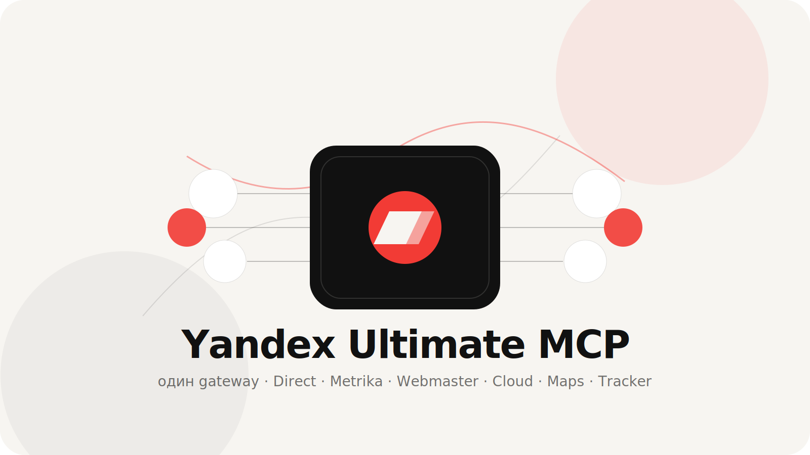
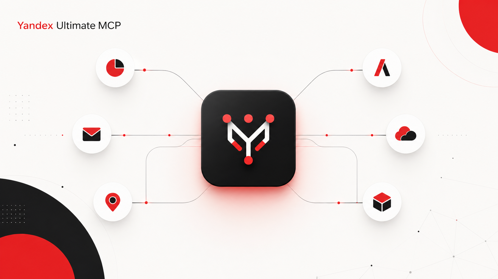

# Yandex Ultimate MCP

> 🇷🇺 **Основной язык — русский.** English quick start is below.



<details><summary>Generated PNG cover</summary>



</details>

**Yandex Ultimate MCP** — неофициальный “ультимативный” MCP-gateway для Яндекс-экосистемы. Он не копирует код чужих серверов: запускает лучшие найденные open-source MCP как дочерние процессы, собирает их tools в один интерфейс, добавляет `doctor`, `auth`-wizard, статусы, нормальные ENV-подсказки и безопасные notices по лицензиям.

## 🚀 Автовход и получение ключей/токенов

Самый быстрый сценарий:

```bash
cd /Users/vlad/yandex-ultimate-mcp
npm run auth
npm run doctor
npm run start
```

Что делает wizard:

1. Просит `YANDEX_CLIENT_ID` от OAuth app.
2. Дает ссылку `https://oauth.yandex.ru/authorize?...`.
3. Ты логинишься и вставляешь **весь callback URL** с `#access_token=...`.
4. Wizard сам вытаскивает token и раскладывает его в:
   - `YANDEX_TOKEN`
   - `YANDEX_METRIKA_TOKEN`
   - `YANDEX_DIRECT_TOKEN`
   - `YANDEX_WEBMASTER_OAUTH_TOKEN`
   - `YANDEX_TRACKER_TOKEN`

Важно: `YANDEX_CLIENT_LOGIN` — это **не токен**. Это логин клиента/аккаунта в Yandex Direct. Если Direct не нужен — пропусти.

Webmaster обычно использует тот же OAuth token. Если в OAuth app нет Webmaster permissions или API-доступ ограничен аккаунтом, `doctor` покажет, что модуль не включился.

Отдельно добираются:

- `YANDEX_TRACKER_ORG_ID` — id организации Tracker;
- `YC_FOLDER_ID` / `YC_OAUTH_TOKEN` — Yandex Cloud;
- `YANDEX_SEARCH_API_KEY` / `YANDEX_SEARCH_FOLDER_ID` — Search API;
- `YANDEX_MAPS_API_KEY` — Maps.

> ⚠️ Если токен случайно попал в чат, логи или скриншот — лучше отозвать его и выпустить новый.

## Что внутри

| Модуль | Что дает | Ожидаемо tools | Источник |
| --- | --- | ---: | --- |
| `stegyan` | Direct + Metrika + Wordstat mega-pack | ~125 | [`@stegyan/yandex-mcp`](https://www.npmjs.com/package/@stegyan/yandex-mcp) |
| `webmaster` | Webmaster: индексирование, SQI, диагностика, ссылки, sitemap, recrawl | ~24 | [`yandex-webmaster-mcp`](https://www.npmjs.com/package/yandex-webmaster-mcp) |
| `tracker` | Tracker issues/queues/comments/worklogs/users | ~21 | [`yandex-tracker-mcp`](https://www.npmjs.com/package/yandex-tracker-mcp) |
| `cloud` | Cloud: Compute, VPC, Storage, PostgreSQL, AI, K8s, Serverless, Security | ~31 | [`yandex-cloud-mcp`](https://www.npmjs.com/package/yandex-cloud-mcp) |
| `maps` | Geocode, reverse geocode, organizations, routes, static maps | ~10 | [`@theyahia/yandex-maps-mcp`](https://www.npmjs.com/package/@theyahia/yandex-maps-mcp) |
| `search` | Yandex Search bridge | ~1 | [`yandex-search-mcp`](https://www.npmjs.com/package/yandex-search-mcp) |
| `cloud_docs` | Поиск/чтение документации Yandex Cloud (optional, off by default) | ~11 | [`@doctorai/yandex-cloud-docs-mcp-server`](https://www.npmjs.com/package/@doctorai/yandex-cloud-docs-mcp-server) |

Плюшки:

- один MCP endpoint вместо пачки разрозненных servers;
- авто-скрытие модулей без токенов, понятный `ultimate_status`;
- `ultimate_auth_help`, `yandex-ultimate auth`, `.env.example` и подробный `docs/AUTH.md`;
- collision-safe tool names: если имена пересеклись, gateway покажет `module__tool`;
- `ULTIMATE_PREFIX_TOOLS=1`, если хочется всегда явно видеть источник tool;
- safe-by-default: секреты не логируются, `.env.local` в `.gitignore`;
- MIT проект + `THIRD_PARTY_NOTICES.md` для upstream MCP.

## Установка

```bash
npm install -g yandex-ultimate-mcp
# или без установки:
npx yandex-ultimate-mcp@latest doctor
```

Для разработки из репозитория:

```bash
git clone https://github.com/lemonchikHere/yandex-ultimate-mcp.git
cd yandex-ultimate-mcp
npm install
cp .env.example .env.local
npm run build
npm run doctor
```

## Подключение к MCP-клиенту

### Codex / Claude Desktop / Cursor-style stdio

```json
{
  "mcpServers": {
    "yandex-ultimate": {
      "command": "npx",
      "args": ["-y", "yandex-ultimate-mcp@latest", "serve"],
      "env": {
        "YANDEX_TOKEN": "...",
        "YANDEX_CLIENT_LOGIN": "...",
        "YANDEX_WEBMASTER_OAUTH_TOKEN": "...",
        "YANDEX_TRACKER_TOKEN": "...",
        "YANDEX_TRACKER_ORG_ID": "...",
        "YC_FOLDER_ID": "...",
        "YANDEX_SEARCH_API_KEY": "...",
        "YANDEX_SEARCH_FOLDER_ID": "...",
        "YANDEX_MAPS_API_KEY": "..."
      }
    }
  }
}
```

Локально из checkout:

```json
{
  "mcpServers": {
    "yandex-ultimate-local": {
      "command": "node",
      "args": ["/ABS/PATH/yandex-ultimate-mcp/dist/src/cli.js", "serve"],
      "env": { "YANDEX_TOKEN": "..." }
    }
  }
}
```

## Быстрый auth

```bash
yandex-ultimate auth
# или
npx yandex-ultimate-mcp@latest auth
```

Wizard принимает полный callback URL, сам вытаскивает `access_token` и пишет `.env.local`. Подробности: [`docs/AUTH.md`](docs/AUTH.md).

## Управление модулями

```bash
# только Direct/Metrika/Wordstat + Webmaster
ULTIMATE_ENABLE_MODULES=stegyan,webmaster yandex-ultimate-mcp serve

# отключить справочник документации
ULTIMATE_DISABLE_MODULES=cloud_docs yandex-ultimate-mcp serve

# всегда namespace-prefix
ULTIMATE_PREFIX_TOOLS=1 yandex-ultimate-mcp serve
```

Management tools внутри MCP:

- `ultimate_status` — что настроено, что включено, какие ошибки у child MCP;
- `ultimate_modules` — каталог модулей/источников/лицензий;
- `ultimate_auth_help` — auth hints;
- `ultimate_refresh_tools` — очистить cache tools.

## Почему gateway, а не “скопировать всё в один server”?

Так лучше юридически и технически:

- upstream MCP остаются самостоятельными пакетами со своими лицензиями;
- обновления подтягиваются через `npx ...@latest`;
- меньше риска сломать чужую реализацию API;
- можно быстро заменить слабый модуль на более полный.

Мы специально **не тащим код** из пакетов с ограничительными/неподходящими лицензиями. Список источников и исключений — в [`docs/SOURCES.md`](docs/SOURCES.md).

## Разработка

```bash
npm install
npm run build
npm run smoke
npm run audit
npm run modules
```

Smoke test запускает только management tools (`ULTIMATE_DISABLE_CHILDREN=1`), чтобы CI не требовал реальных токенов.

---

# English quick start

**Yandex Ultimate MCP** is an unofficial MCP gateway for the Yandex ecosystem. It aggregates existing open-source Yandex MCP servers behind one stdio endpoint and adds auth helpers, diagnostics, module controls and license notices.

```bash
npm install -g yandex-ultimate-mcp
yandex-ultimate-mcp doctor
yandex-ultimate-mcp auth
yandex-ultimate-mcp serve
```

Read [`docs/AUTH.md`](docs/AUTH.md) for tokens/API keys and [`THIRD_PARTY_NOTICES.md`](THIRD_PARTY_NOTICES.md) for upstream modules.

## License

MIT for this gateway. Upstream MCP packages keep their own licenses and are executed as separate child processes.
